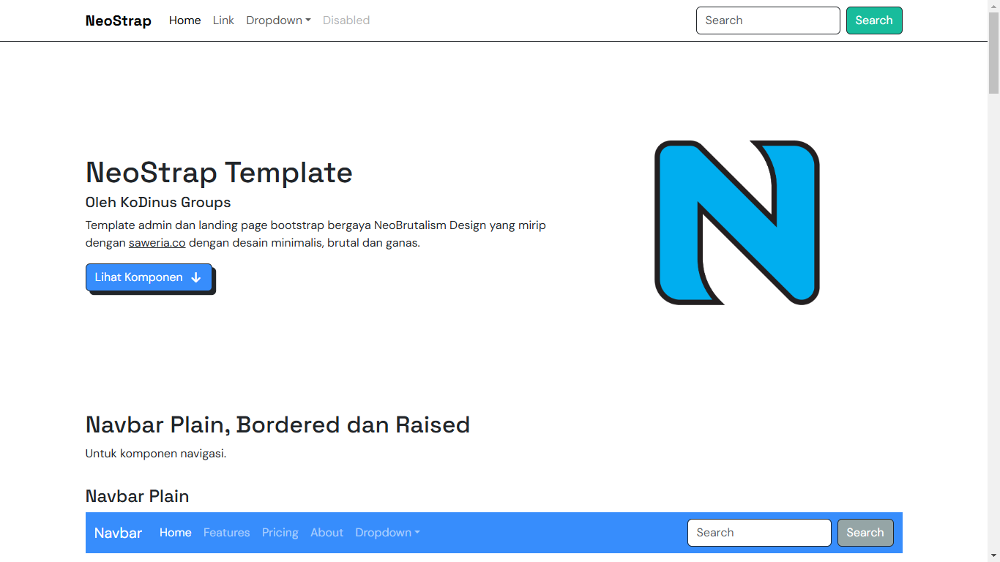
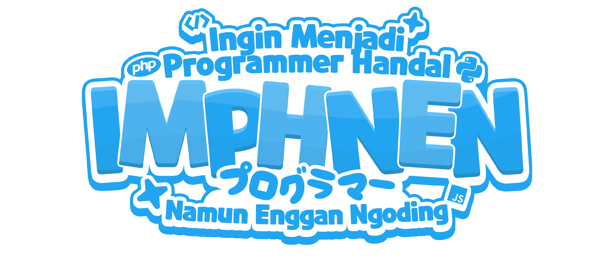

<div align="center" style="margin-bottom: 1rem">
  <a href="./README.md"><strong>English</strong></a>
  <span style="margin-left: .5rem;margin-right: .5rem">•</span>
  <a href="./README-id.md">Indonesian</a>
</div>

<h1 align="center">NeoStrap Template</h1>



<p align="center">The latest Bootstrap 5 template with a NeoBRUTALISM style that is simple, bold, and fierce!</p>

<div align="center">

  [](https://github.com/kokodingin/neostrap-core/graphs/contributors)
  
  
  [](LICENSE)
  
  <hr />

  <p>This project is supported and sponsored by:</p>

  <div style="text-align: center">
    <a href="https://www.facebook.com/groups/programmerhandal/">
      
    </a>
  </div>

  <p align="center">
    <a href="http://neostrap.kokodingin.id">Demo Page</a>
    <span style="margin-left: .5rem;margin-right: .5rem">•</span>
    <a href="./CONTRIBUTE.md">READ THE CONTRIBUTION GUIDE!</a>
    <span style="margin-left: .5rem;margin-right: .5rem">•</span>
    <a href="./LICENSE">LICENSE</a>
  </p>
</div>

## ⚡ Quick Start

1. Download or clone the repository
```bash
git clone https://github.com/kokodingin/neostrap-core.git
```

2. Install dependencies
```bash
npm install
yarn install
pnpm install
bun install
```

3. Run the development server
```bash
npm run dev
yarn dev
pnpm run dev
bun run dev
```

### 📁 Folder Structure
```
neostrap/
|   .editorconfig
|   .env
|   .gitignore
|   .prettierignore
|   .prettierrc
|   .tsconfig.json
|   LICENSE
|   logo-sponsor-imphnen-xxxhdpi.png
|   package.json
|   README.md
|   screenshot.png
|   vite.config.ts
|
+---.vscode
|       launch.json
|
+---src
|   |   404.html
|   |   500.html
|   |   503-cs.html
|   |   index.html
|   |
|   +---assets
|   |   +---js
|   |   |       init-theme.ts
|   |   |       neostrap.ts
|   |   |
|   |   +---scss
|   |   |   |   bootstrap.scss
|   |   |   |   neostrap.scss
|   |   |   |   _variables-dark.scss
|   |   |   |   _variables.scss
|   |   |   |
|   |   |   \---neobrutalism
|   |   |           core.scss
|   |   |           _alert.scss
|   |   |           _brutal-design.scss
|   |   |           _button.scss
|   |   |           _card.scss
|   |   |           _dropdown.scss
|   |   |           _input.scss
|   |   |           _navbar.scss
|   |   |           _root.scss
|   |   |
|   |   \---static
|   |       |   apple-touch-icon-114x114.png
|   |       |   apple-touch-icon-120x120.png
|   |       |   apple-touch-icon-144x144.png
|   |       |   apple-touch-icon-152x152.png
|   |       |   apple-touch-icon-57x57.png
|   |       |   apple-touch-icon-60x60.png
|   |       |   apple-touch-icon-72x72.png
|   |       |   apple-touch-icon-76x76.png
|   |       |   favicon-128.png
|   |       |   favicon-16x16.png
|   |       |   favicon-196x196.png
|   |       |   favicon-32x32.png
|   |       |   favicon-96x96.png
|   |       |   favicon.ico
|   |       |   mstile-144x144.png
|   |       |   mstile-150x150.png
|   |       |   mstile-310x150.png
|   |       |   mstile-310x310.png
|   |       |   mstile-70x70.png
|   |       |
|   |       +---brands
|   |       |
|   |       \---js
|   |               all.js
|   |
|   \---layouts
|       |   master.html
|       |   single.html
|       |
|       \---partials
|           |   favicon.html
|           |   font.html
|           |
|           +---footer
|           |       single.html
|           |
|           \---navbars
|                   primary.html
|
\---types
    \---vite-env.d.ts
```

## 📁 Included Features
- ✅ Vite + TypeScript setup
- ✅ Integrated Bootstrap 5
- ✅ SCSS/SASS support
- ✅ NeoBrutalism components & styles
- ✅ Hot reload
- ✅ Production-ready builds

## 📦 Production Build
```bash
npm run build
```

## 💻 Development
Start editing files in the `src/` folder according to your needs. All Bootstrap components are available and ready for use.
